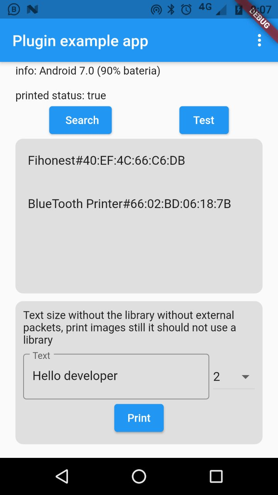
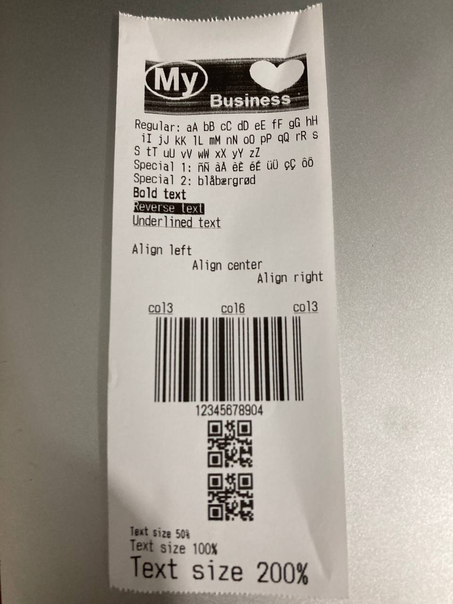

# print_bluetooth_thermal

## Package to print tickets on 58mm or 80mm thermal printers on Android.

This package emerged as an alternative to the current ones that use the location permission and Google Play
blocks apps that don't explain what to use location permission for.

> If you want to supply the swift code, you need to receive raw bytes to use the byte class

## Getting Started

* Import the package  [print_bluetooth_thermal](https://pub.dev/packages/print_bluetooth_thermal).

* If you want to print images, qr code, barcode use the package [esc_pos_utils_plus](https://pub.dev/packages/esc_pos_utils_plus).

<br/>

1. Import the package

```dart
import 'package:print_bluetooth_thermal/print_bluetooth_thermal.dart';
```

2. After that you can use 
``` dart
PrintBluetoothThermal
```

<br/>

# Available functions

| Comando | Descripción |
| --- | --- |
| PrintBluetoothThermal.bluetoothEnabled | returns true if bluetooth is on |
| PrintBluetoothThermal.pairedBluetooths | retronates all paired bluetooth on the device |
| PrintBluetoothThermal.connectionStatus | returns true if you are currently connected to the printer |
| PrintBluetoothThermal.connect | send connection to ticket printer and wait true if it was successful, the mac address of the printer's bluetooth must be sent |
| PrintBluetoothThermal.writeBytes | send bytes to print, esc_pos_utils_plus package must be used, returns true if successfu |
| PrintBluetoothThermal.writeString | Strings are sent to be printed by the PrintTextSize class can print from size 1 (50%) to size 5 (400%) |
| PrintBluetoothThermal.platformVersion | gets the android version where it is running, returns String |
| PrintBluetoothThermal.batteryLevel | get the percentage of the battery returns int |

<br/>

# Examples

**Detect if bluetooth is turned on**
```dart
final bool result = await PrintBluetoothThermal.bluetoothEnabled;
```

**read paired bluetooth**
<br/>
_read the bluetooth linked to the phone, to be able to connect to the printer it must have been previously linked in phone settings bluetooth option_
```dart
final List listResult = await PrintBluetoothThermal.pairedBluetooths;
  await Future.forEach(listResult, (bluetooth) {
    String item = bluetooth as String;
    List<String> lista = item.split("#");
    String name = lista[0];
    String mac = lista[1];
  });
```

**Connect printer**
```dart
String mac = "66:02:BD:06:18:7B";
final bool result = await PrintBluetoothThermal.connect(macPrinterAddress: mac);
```

**Detect if connection status**
```dart
final bool conexionStatus = await PrintBluetoothThermal.connectionStatus;
```

**Print text of different sizes**
```dart
 bool conexionStatus = await PrintBluetoothThermal.connectionStatus;
  if (conexionStatus) {
    String enter = '\n';
    await PrintBluetoothThermal.writeBytes(enter.codeUnits);
    //size of 1-5
    String text = "Hello $enter";
    await PrintBluetoothThermal.writeString(printText: PrintTextSize(size: 1, text: text + " size 1"));
    await PrintBluetoothThermal.writeString(printText: PrintTextSize(size: 2, text: text + " size 2"));
    await PrintBluetoothThermal.writeString(printText: PrintTextSize(size: 3, text: text + " size 3"));
    await PrintBluetoothThermal.writeString(printText: PrintTextSize(size: 2, text: text + " size 4"));
    await PrintBluetoothThermal.writeString(printText: PrintTextSize(size: 3, text: text + " size 5"));
  } else {
    print("the printer is disconnected ($conexionStatus)");
  }
```

**Print on the printer with the package** [esc_pos_utils_plus](https://pub.dev/packages/esc_pos_utils_plus).
<br/>
_call PrintTest()_
```dart
Future<void> printTest() async {
    bool conecctionStatus = await PrintBluetoothThermal.connectionStatus;
    if (conecctionStatus) {
      List<int> ticket = await testTicket();
      final result = await PrintBluetoothThermal.writeBytes(ticket);
      print("print result: $result");
    } else {
      //no connected
    }
}

Future<List<int>> testTicket() async {
    List<int> bytes = [];
    // Using default profile
    final profile = await CapabilityProfile.load();
    final generator = Generator(PaperSize.mm58, profile);
    //bytes += generator.setGlobalFont(PosFontType.fontA);
    bytes += generator.reset();

    final ByteData data = await rootBundle.load('assets/mylogo.jpg');
    final Uint8List bytesImg = data.buffer.asUint8List();
    final image = Imag.decodeImage(bytesImg);
    // Using `ESC *`
    bytes += generator.image(image!);

    bytes += generator.text('Regular: aA bB cC dD eE fF gG hH iI jJ kK lL mM nN oO pP qQ rR sS tT uU vV wW xX yY zZ', styles: PosStyles());
    bytes += generator.text('Special 1: ñÑ àÀ èÈ éÉ üÜ çÇ ôÔ', styles: PosStyles(codeTable: 'CP1252'));
    bytes += generator.text(
      'Special 2: blåbærgrød',
      styles: PosStyles(codeTable: 'CP1252'),
    );

    bytes += generator.text('Bold text', styles: PosStyles(bold: true));
    bytes += generator.text('Reverse text', styles: PosStyles(reverse: true));
    bytes += generator.text('Underlined text', styles: PosStyles(underline: true), linesAfter: 1);
    bytes += generator.text('Align left', styles: PosStyles(align: PosAlign.left));
    bytes += generator.text('Align center', styles: PosStyles(align: PosAlign.center));
    bytes += generator.text('Align right', styles: PosStyles(align: PosAlign.right), linesAfter: 1);

    bytes += generator.row([
      PosColumn(
        text: 'col3',
        width: 3,
        styles: PosStyles(align: PosAlign.center, underline: true),
      ),
      PosColumn(
        text: 'col6',
        width: 6,
        styles: PosStyles(align: PosAlign.center, underline: true),
      ),
      PosColumn(
        text: 'col3',
        width: 3,
        styles: PosStyles(align: PosAlign.center, underline: true),
      ),
    ]);

    //barcode
    final List<int> barData = [1, 2, 3, 4, 5, 6, 7, 8, 9, 0, 4];
    bytes += generator.barcode(Barcode.upcA(barData));

    //QR code
    bytes += generator.qrcode('example.com');

    bytes += generator.text(
      'Text size 50%',
      styles: PosStyles(
        fontType: PosFontType.fontB,
      ),
    );
    bytes += generator.text(
      'Text size 100%',
      styles: PosStyles(
        fontType: PosFontType.fontA,
      ),
    );
    bytes += generator.text(
      'Text size 200%',
      styles: PosStyles(
        height: PosTextSize.size2,
        width: PosTextSize.size2,
      ),
    );

    bytes += generator.feed(2);
    //bytes += generator.cut();
    return bytes;
}
```

# Screenshot of the example app, you can copy the code from the example

# Ticket printed with various forms



# Built with 🛠️

_Thanks to these tools this fabulous project has been created_

* [Dart](https://dart.dev/) - language used
* [kotlin](https://kotlinlang.org/) - language used
* [Flutter](https://flutter.dev/) - framework used

# License
Note: This license has also been called the "New BSD License" or "Modified BSD License". See also the 2-clause BSD License.

Copyright <YEAR> <COPYRIGHT HOLDER>

Redistribution and use in source and binary forms, with or without modification, are permitted provided that the following conditions are met:

1. Redistributions of source code must retain the above copyright notice, this list of conditions and the following disclaimer.

2. Redistributions in binary form must reproduce the above copyright notice, this list of conditions and the following disclaimer in the documentation and/or other materials provided with the distribution.

3. Neither the name of the copyright holder nor the names of its contributors may be used to endorse or promote products derived from this software without specific prior written permission.

THIS SOFTWARE IS PROVIDED BY THE COPYRIGHT HOLDERS AND CONTRIBUTORS "AS IS" AND ANY EXPRESS OR IMPLIED WARRANTIES, INCLUDING, BUT NOT LIMITED TO, THE IMPLIED WARRANTIES OF MERCHANTABILITY AND FITNESS FOR A PARTICULAR PURPOSE ARE DISCLAIMED. IN NO EVENT SHALL THE COPYRIGHT HOLDER OR CONTRIBUTORS BE LIABLE FOR ANY DIRECT, INDIRECT, INCIDENTAL, SPECIAL, EXEMPLARY, OR CONSEQUENTIAL DAMAGES (INCLUDING, BUT NOT LIMITED TO, PROCUREMENT OF SUBSTITUTE GOODS OR SERVICES; LOSS OF USE, DATA, OR PROFITS; OR BUSINESS INTERRUPTION) HOWEVER CAUSED AND ON ANY THEORY OF LIABILITY, WHETHER IN CONTRACT, STRICT LIABILITY, OR TORT (INCLUDING NEGLIGENCE OR OTHERWISE) ARISING IN ANY WAY OUT OF THE USE OF THIS SOFTWARE, EVEN IF ADVISED OF THE POSSIBILITY OF SUCH DAMAGE.

<br/>

Created with ❤️ by [andresperezmelo](https://github.com/andresperezmelo) 😊
[Andres Perez Melo](https://www.linkedin.com/in/andr%C3%A9s-p%C3%A9rez-melo-756413218/)


